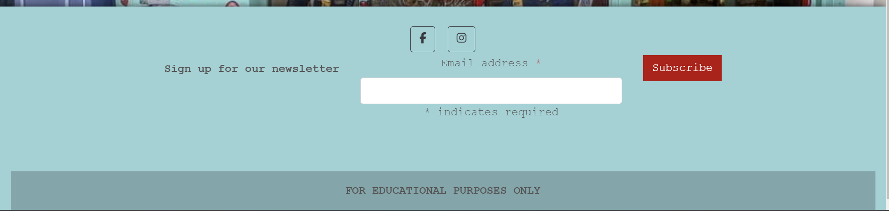

# Let's Eat

"Let's Eat" represents my utilization of the Django Full Stack framework for Portfolio Project 4. This fully responsive website is strategically designed with an inviting color scheme and an intuitive layout to optimize user engagement. The deliberate design choices aim to attract users by offering a seamless browsing experience for recipes categorized for easy navigation. The focus lies not only on aesthetics but also on functionality, aiming to maintain user interest and encourage prolonged interaction. The website's design ethos is centered on user retention through an interface that facilitates easy exploration, providing users with a platform where they can effortlessly discover, comment on, and engage with a wide range of recipes.
  
  

[Click Here To Visit Live Site](https://maryclaireteahan-letseat-0b5910f8e882.herokuapp.com/)  

## Table Of Contents:
1. [Design & Planning](#design-&-planning)
    * [User Stories](#user-stories)
    * [Wireframes](#wireframes)
    * [Agile Methodology](#agile-methodology)
    * [Typography](#typography)
    * [Colour Scheme](#colour-scheme)
    * [Database Diagram](#database-diagram)
    
2. [Features](#features)
    * [Navigation](#Navigation-bar)
    * [Footer](#footer)
    * [Index page](#index-page)
    * [Events page](#events-page)
    * [Single event page](#single-event-page)
    * [Edit event page](#edit-event-page)
    * [Delete event page](#delete-event-page)
    * [Create event page](#create-event-page)
    * [Products page](#products-page)
    * [Single Product page](#single-Product-page)
    * [Edit Product page](#edit-Product-page)
    * [Delete Product page](#delete-Product-page)
    * [Create Product page](#create-Product-page)
    * [Login page](#login-page)
    * [Logout page](#logout-page)
    * [Sign up page](#signup-page)
    * [404 Error page](#404-error-page)

3. [Future Features](#future-features)
4. [Technologies Used](#technologies-used)
5. [Libraries](#libraries-used)
6. [Testing](#testing)
7. [Bugs](#bugs)
8. [Deployment](#deployment)
9. [Credits](#credits)
10. [Acknowledgements](#acknowledgements)

## Design & Planning

<details>

### User Stories

#### Site User
- As a Site User, I can view a list of recipes so that I can choose one to read
- As a Site User, I can click on a recipe post so that I can read the full recipe
- As a Site User, I can click a like button so that I can like a recipe and then unlike if needed
- As a Site User, I can post a comment on a recipe post so that I can interact with the site's community
- As a Site User, I can sign up to be a member/ login as an existing member so that I can be a part of the site's community and receive updates
- As a Site User, I can see how many likes a post has received so that I can see what recipes are most popular
- As a Site User, I can see who commented what under each post so that I can see what the Site Users think of specific recipes and how they might change them
- As a Site User, I can edit or delete my comment so that if I made a spelling error or changed my mind about what I said I can edit or delete it

#### Site Admin
- As a Site Admin, I can see how many likes a post has received so that I can see what recipes are most popular
- As a Site Admin, I can see who commented what under each post so that I can see what the Site Users think of specific recipes and how they might change them
- As a Site Admin, I can create, edit and delete recipe posts so that I can be in control of what content is shown to Site Users
- As a Site Admin, I can assign a category to the recipe post so that Site Users will be able to find recipes specific to what they need


### Wireframes
Below are the wireframes for the site that I created using balsamiq. As I was developing my website I was using agile approach and adding/updating my website/elements so for that reason some wireframes are not matching my final product.

<details><summary>Index</summary>

</details>

<details><summary>Recipe Categories</summary>

</details>

<details><summary>Single Recipe</summary>

</details>

<details><summary>Edit Comment page</summary>

</details>

<details><summary>Delete Comment and Delete Recipe</summary>

</details>

<details><summary>Create and Edit Recipe</summary>

</details>

<details><summary>Login page</summary>

</details>

<details><summary>Logout page</summary>

</details>

<details><summary>Sign up page</summary>

</details>


### Agile Methodology
I used the Agile Methodology to plan this project. I found it difficult to follow the project plan alongside coding. Often when I was coding an issue would arise that I hadn't foreseen would and I would have to deal with that which may then lead to a brand new feature. That then would lead me to another unplanned feature. It was difficult to stay following the plan as a result. I do recognise now, the importance of following the plan and, if a new feature presents itself, taking the time to review the plan and adjust if necessary.
I've used Github and the Project Board with use of the Kanban board.

I divided the project board into 3 sections:

  -  To-Do- (All the User stories were initially entered in the 'To Do' column)
  -  In Progress- (then during development story they were moved into the 'In Progress' column)
  -  Done- (and then finally they get moved into 'Done' once the development completes)

<details><summary>Project board</summary>

</details>

- I've planned 5 milestones for this project. Each milestone features issues that are completed as well as open issues that may be implemented in future development.

<details><summary>Milestones</summary>

</details>

- Each milestone consist of user stories, which are displayed either open or closed depending on the progress.
- I have implemented the MoSCoW method to prioritise my user stories. each user story either has "Must Have" "Should Have" "Could Have" "Won't Have"

<details><summary>Milestone detail</summary>


</details>

- Each user story have acceptance criteria and tasks that needed to be done to accomplish that criteria as well as fixed bugs if relevant
 

<details><summary>User story detail</summary>

</details>
</details>
</details>

- - -

### Typography

<details>

Google Fonts were used to import Oxygen font into styles.css.  It was chosen as it is a simple, font with a strong clear feel that doesn't distract from the content.
</details>

- - -

### Colour Scheme

<details>

For this website, I chose a hero image and based the color palette off of that. There is a contrast between the dark fonts and light backgrounds in order to keep the site accessible.
  
<details><summary>Color palette</summary>


</details>
</details>

- - -

### DataBase Diagram

<details>

Below is the database diagram that I created using LucidCharts.

<details><summary>DataBase diagram</summary>

</details>  
</details>

- - -

## Features:

<details>

### Navigation Bar
- The navigation bar has a consistent look and placement on all three pages of the website supporting easy navigation.  It includes a simple Logo, and the menu options: Home page, Recipes page, Login page, Signup page, Logout page and Add Recipe and is responsive on multiple screen sizes. The menu options are hidden until a burger icon is clicked which then brings up the menu options.

<details><summary>Navbar</summary>


</details>


### Footer
- The footer is featured on all five pages and is identical on each page making it easy to use.  It contains links to Adrienne's social media accounts, facebook, twitter, youtube, instagram and linkedin. The links are represented by favicon images of those sites' own logos.
  
<details><summary>Footer</summary>

</details>

### Index Page
- This section of text introduces the user to the blogger, Mary, and gives them a sense of what to expect if they continue reading the blog. The user is enticed to with a "Discover Recipes" button to move to the recipes page.

<details><summary>Index Hero</summary>

</details>
<details><summary>Index Button</summary>

</details>


### Recipes page
- This section of text gives the user five categories of recipes to browse, Breakfast, Lunch, Dinner, Dessert and Snack. The recipes are presented horizontally with use of a scrollbar if there are enough recipes that they don't fit the width of the screen size. Each recipe has a name and image, either of which can be clicked to reidirect to the recipe page.

<details><summary>Recipe Categories</summary>


</details>
<details><summary>Recipe Categories Scrollbar</summary>

</details>

  
### Single Recipe page
- This user is redirected to this section after selecting the recipe in the previous page. If the user is an admin they will see an option to edit or delete the recipe. The user will see the same image as the previous page, the ingredients and instructions. Underneath this is the comment section. Is the user has logged in they will be able to leave a comment as well as edit or delete it once posted, they will not be able to make any changes to other users' comments. If a user is not logged in they cannot leave a comment however they can read other users' comments

<details><summary>Single Recipe Like and Comment Icons</summary>

</details><details><summary>Single Recipe Comments</summary>


</details>

### Edit Comment page
- On this page the logged in user will see a textarea which contains the comment they had already left and on which they clicked edit. The user with be able to make changes to their comment and resubmit it. 

<details><summary>Edit comment page</summary>


</details>

### Delete Comment page
- The user will be redirected to this page when they click delete on their comment in order to make sure they want to delete the comment. The user will be asked if they are sure and they can either hit delete or cancel. Delete will delete the comment comepletely. Cancel will redirect to the home screen

<details><summary>Delete comment page</summary>


</details>

### Create recipe page
- Only user admin has access to this page. The user admin will be required to fill out each field before they can submit the recipe which will publish immediately.

<details><summary>Create recipe page</summary>


</details>

### Edit recipe page
- On this page the logged in user admin will see textareas in the same format as the creat recipe form which contains the recipe content they had already submitted and on which they clicked edit. The user with be able to make changes to their recipe and resubmit it. 

<details><summary>Edit recipe page</summary>


</details>

### Delete recipe page
- The user will be redirected to this page when they click delete on their recipe in order to make sure they want to delete the comment. The user will be asked if they are sure and they can either hit delete or cancel. Delete will delete the recipe comepletely. Cancel will redirect to the home screen

<details><summary>Delete recipe page</summary>


</details>

### Login page
- Login page is a basic django allauth form that has 2 input fields for username and password with sign in the button below it
- A User will also have description links to either signup for the website if he doesnt have an account which will redirect a user the "Sign up" page

<details><summary>Login page</summary>


</details>

### Logout page
- The user will be redirected to this page when they click logout. The user will be asked if they are sure they want to logout and they can either hit logout or cancel. Logout will log the user out. Cancel will redirect to the home screen

<details><summary>Logout page</summary>


</details>

### Signup page
- The signup page is also a standard django form with all required fields for a user to input
- User must input all information (username, email (optional) and password) 
- After inputting all the fields and clicking sign-up button user will be automatically logged in and redirected to the home page.

<details><summary>Sign up page</summary>


</details>

### 404 Error Page
- If an invalid url is input or an unauthorised user tries to create a recipe or edit/delete a recipe or another user's comment by brute forcing their urls they will see this page.

<details><summary>404 Error page</summary>


</details>

</details>

- - -

## Future Features

<details>

There are 3 features that I would like to implement in the next iteration that would improve user experience and attract more traffic to my website
- Give users the option to reply to other users' comments
- Allow users to reset their passwords
- Add a top picks section where the user admin can update their top picks of their recipes weekly
- Have the user redirected to the relevant recipe page when edit or delete their comment on that recipe 
- Have the admin redirected to the relevant recipe page when edit or delete that recipe or create a recipe 

</details>

- - -

## Technologies Used

<details>

- [Balsamiq](https://en.wikipedia.org/wiki/Balsamiq) was used to create the wireframes.
- [LucidChart](https://www.lucidchart.com/pages/) was used to design the database schema.
- [HTML](https://en.wikipedia.org/wiki/HTML) was used for the mark up.
- [CSS](https://en.wikipedia.org/wiki/CSS)  was used to style the site.
- [Django](https://www.djangoproject.com/) was the framework that was used.
- [Python](https://en.wikipedia.org/wiki/Python_(programming_language)), django is a python framework.
- [JavaScript](https://en.wikipedia.org/wiki/JavaScript) was used for interactiveness with the messages.
- [Visual Studio Code](https://www.gitpod.io/about) was used to create this site and then push everything to github.
- [Heroku](https://en.wikipedia.org/wiki/Heroku) is used to host this site.
- [Github](https://en.wikipedia.org/wiki/GitHub) was used to store the code.
- [Git](https://en.wikipedia.org/wiki/Git) was used for version control.
- [Cloudinary](https://cloudinary.com/) was used to store the images.
- [ElephantSQL](https://www.elephantsql.com/) was used to store the database.

</details>

- - -

## Libraries

<details>

- asgiref - A standard Python library to allow for asynchronous web apps and servers to communicate with each other.
- cloudinary - A Python package allowing integration between the application and Cloudinary.
- dj-database-url - A Django utility to utilise the DATABASE_URL environment variable to configure the Django application. Used with PostgreSQL.
- dj3-cloudinary-storage - A Django package that facilitates integration with Cloudinary storage.
- Django - A python package for the Django framework.
- django-allauth - An integrated set of Django applications addressing user authentication, registration and account management.
- django-crispy-forms - A Django package that provides tags and filters to control the rendering behaviour of Django forms. 
- django-summernote - is a third-party package that provides a rich text editor widget for Django web applications.
- gunicorn - A Python WSGI HTTP Server for UNIX.
- oauthlib - A generic, spec-compliant, thorough implementation of the OAuth request-signing logic for Python 3.6+.
- psycopg2 - A PostgreSQL database adapter for Python.
- python3-openid - A set of Python packages to support use of the OpenID decentralized identity system.
- pytz - A Python package for world timezone definitions, modern and historical.
- requests-oauthlib - A Python package for OAuthlib authentication support for Requests.
- sqlparse - A non-validating SQL parser for Python.

</details>

- - -

## Testing

<details>

The testing section can be found [here](TESTING.md).
</details>

- - -

##  Deployment & Local Development

<details>

The live deployment application can be found on [Heroku](https://maryclaireteahan-letseat-0b5910f8e882.herokuapp.com/).

###   Local Development


#### How to Fork

To fork the repository:

1. Log in (or sign up) to Github.

2. Go to the repository for this project, [letseat](https://github.com/maryclaireteahan/letseat).


3. Click the Fork button in the top right corner.

#### How to Clone

To clone the repository:

1. Log in (or sign up) to GitHub.

2. Go to the repository for this project, [letseat](https://github.com/maryclaireteahan/letseat).

3. Click on the code button, select whether you would like to clone with HTTPS, SSH or GitHub CLI and copy the link shown.

4. Open the terminal in your code editor and change the current working directory to the location you want to use for the cloned directory.

5. Type the following command in the terminal (after the git clone you will need to paste the link you copied in step 3 above):

    ```bash
    git clone https://github.com/maryclaireteahan/letseat
    ```

6. Set up a virtual environment (this step is not required if you are using the Code Institute Template in GitPod as this will already be set up for you).

7. Install the packages from the requirements.txt file by running the following command in the Terminal:

    ```bash
    pip3 install -r requirements.txt
    ```


### ElephantSQL Database

This project uses [ElephantSQL](https://www.elephantsql.com) for the PostgreSQL Database.

To obtain your own Postgres Database, sign-up with your GitHub account, then follow these steps:
- Click **Create New Instance** to start a new database.
- Provide a name (this is commonly the name of the project: tribe).
- Select the **Tiny Turtle (Free)** plan.
- You can leave the **Tags** blank.
- Select the **Region** and **Data Center** closest to you.
- Once created, click on the new database name, where you can view the database URL and Password.


### Cloudinary API

This project uses the [Cloudinary API](https://cloudinary.com) to store media assets online, due to the fact that Heroku doesn't persist this type of data.

To obtain your own Cloudinary API key, create an account and log in.
- For *Primary interest*, you can choose *Programmable Media for image and video API*.
- Optional: *edit your assigned cloud name to something more memorable*.
- On your Cloudinary Dashboard, you can copy your **API Environment Variable**.
- Be sure to remove the `CLOUDINARY_URL=` as part of the API **value**; this is the **key**.


### Heroku Deployment

This project uses [Heroku](https://www.heroku.com), a platform as a service (PaaS) that enables developers to build, run, and operate applications entirely in the cloud.

Deployment steps are as follows, after account setup:

- Select **New** in the top-right corner of your Heroku Dashboard, and select **Create new app** from the dropdown menu.
- Your app name must be unique, and then choose a region closest to you (EU or USA), and finally, select **Create App**.
- From the new app **Settings**, click **Reveal Config Vars**, and set your environment variables.

| Key | Value |
| --- | --- |
| `CLOUDINARY_URL` | Insert your own Cloudinary API key here |
| `DATABASE_URL` | Insert your own ElephantSQL database URL here |
| `DISABLE_COLLECTSTATIC` | 1 (*this is temporary, and can be removed for the final deployment*) |
| `SECRET_KEY` | This can be any Django random secret key |
| `EMAIL_USER` | Insert your e-mail (a gmail was used) |
| `EMAIL_HOST_PASSWORD` | Insert the app password |


Heroku needs two additional files in order to deploy properly.
- requirements.txt
- Procfile

You can install this project's **requirements** (where applicable) using:
```bash
pip3 install -r requirements.txt
```

If you have your own packages that have been installed, then the requirements file needs updated using:
```bash
pip3 freeze --local > requirements.txt
```

The **Procfile** can be created with the following command:
```bash
echo web: gunicorn app_name.wsgi > Procfile
```
- *replace **app_name** with the name of your primary Django app name; the folder where settings.py is located*

For Heroku deployment, follow these steps to connect your own GitHub repository to the newly created app:

Either:
- Select **Automatic Deployment** from the Heroku app.

Or:
- In the Terminal/CLI, connect to Heroku using this command: 
```bash
heroku login -i
```

- Set the remote for Heroku: 
```bash
heroku git:remote -a app_name #(replace *app_name* with your app name)
```

- After performing the standard Git `add`, `commit`, and `push` to GitHub, you can now type:
```bash
git push heroku main
```
The project should now be connected and deployed to Heroku!


### Local Deployment

This project can be cloned or forked in order to make a local copy on your own system.

For either method, you will need to install any applicable packages found within the *requirements.txt* file.
- `pip3 install -r requirements.txt`.

You will need to create a new file called `env.py` at the root-level,
and include the same environment variables listed above from the Heroku deployment steps.

Sample `env.py` file:

```python
import os

os.environ.setdefault("CLOUDINARY_URL", "insert your own Cloudinary API key here")
os.environ.setdefault("DATABASE_URL", "insert your own ElephantSQL database URL here")
os.environ.setdefault("SECRET_KEY", "this can be any random secret key")

# local environment only (do not include these in production/deployment!)
os.environ.setdefault("DEBUG", "True")
```

Once the project is cloned or forked, in order to run it locally, you'll need to follow these steps:
- Start the Django app: 
```bash
python3 manage.py runserver
```
- Stop the app once it's loaded: `CTRL+C` or `⌘+C` (Mac)
- Make any necessary migrations:
```bash
python3 manage.py makemigrations
```
- Migrate the data to the database:
```bash
python3 manage.py migrate
```
- Create a superuser:
```bash
python3 manage.py createsuperuser
```
- Run the Django app:
```bash
python3 manage.py runserver
```

</details>

- - -

## Credits

<details>

- [Stack Overflow](https://stackoverflow.com/) 
- [W3schools](https://www.w3schools.com/) 
- [CodeInstitute](https://learn.codeinstitute.net/) for their walkthrough project, which guided me with website build especially for publishing posts, comments and likes section which I code along with the video with few adjustments
- [BBC Good Food](https://www.bbcgoodfood.com/) for providing me some text and useful information for my posts
- [youtube](https://www.youtube.com/) videos from **Dee Mc**. I watched her Django Recipe Sharing Tutorial from which I got a lot of help for the overall development for a Django project.
- [Medium](https://medium.com/) in particular, an article by **Adi Ramadhan**, Django CRUD with Forms and Bootstrap Template, for help coding in CRUD functionality
- [Django Documentation](https://docs.djangoproject.com/en/4.2/) For all queries regarding django including, models, views, forms, urls, settings, alert messages
- [Shopify](https://www.shopify.com/) for providing me with tools to easier generate my idea and create logo
- [Djangoforbeginners](https://djangoforbeginners.com/) for providing useful information abut basic concepts and setup for django
- [Lucidchart](https://lucid.app/) for providing me with tools to create my database system
- [Balsamiq](https://balsamiq.com/wireframes/) was used to create wireframes
- [mycolor](https://mycolor.space/) was used to generate color gradient
</details>

- - -

## Acknowledgements:

<details>

- I would like to thank my mentor Lauren-Nicole for all her support and guidance during this project 
- I would also like to thank our cohort facilitator Marko Tot, for sending me useful links as well as giving me one to one support when I was struggling particularly with the models and 404 error page.
- I would like to thank my classmates Hennadi and Mehatab who also helped me a lot when I was struggling with my models.
</details>

- - -

[Back to the top](#let's-eat)
