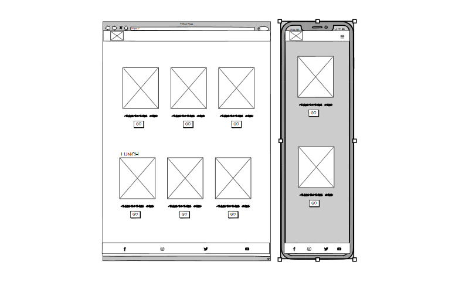
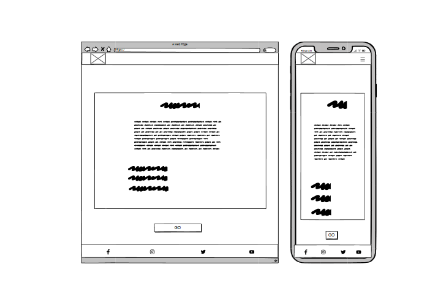

# Hazel's Nuts About Vintage

"Hazel's Nuts About Vintage" is a chill online vintage shop I put together using the Django Full Stack framework for Portfolio Project 5. The website has a laid-back vibe with a straightforward layout, making it easy for you to check out a variety of cool vintage items. The design gives off a nostalgic feel, and the inviting color scheme sets the mood for a fun browsing experience. Explore the curated collection, take a trip down memory lane, and discover unique finds that tell stories of the past. Hazel's Nuts About Vintage is your go-to spot for a relaxed virtual journey into the world of timeless treasures!

  

[Click Here To Visit Live Site](https://mteahan-hazelsnutsaboutvintage-c846730bed11.herokuapp.com/)  

## Table Of Contents:
1. [Design & Planning](#design-&-planning)
    * [User Stories](#user-stories)
    * [Wireframes](#wireframes)
    * [Agile Methodology](#agile-methodology)
    * [Typography](#typography)
    * [Colour Scheme](#colour-scheme)
    * [Database Diagram](#database-diagram)
    
2. [Features](#features)
    * [Navigation](#Navigation-bar)
    * [Footer](#footer)
    * [Index page](#index-page)
    * [Events page](#events-page)
    * [Single event page](#single-event-page)
    * [Edit event page](#edit-event-page)
    * [Delete event page](#delete-event-page)
    * [Create event page](#create-event-page)
    * [Products page](#products-page)
    * [Single Product page](#single-Product-page)
    * [Edit Product page](#edit-Product-page)
    * [Create Product page](#create-Product-page)
    * [Sign in page](#signin-page)
    * [Sign Out page](#Signout-page)
    * [Sign up page](#signup-page)
    * [404 Error page](#404-error-page)

3. [Future Features](#future-features)
4. [Technologies Used](#technologies-used)
5. [Libraries](#libraries-used)
6. [Testing](#testing)
7. [Bugs](#bugs)
8. [Deployment](#deployment)
9. [Credits](#credits)
10. [Acknowledgements](#acknowledgements)

## Design & Planning

<details>

### User Stories

#### Site User
- As a Site User, I can view a list of products so that I can choose one to buy
- As a Site User, I can view a product so that I can inspect the product in more detail and add it to my bag
- As a Site User, I can click an Add to Bag button so that I can ladd the product to my bag to purchase
- As a Site User, I can enter my details so that I can pay for the product and have it delivered to the correct address
- As a Site User, I can give feedback so that I can let the store owner know about my experience with the online store
- As a Site User, I can get a coupon for a discount so that I can use it in-store
- As a Site User, I can view a list of events so that I can see if the store is running any events I would be interested in
- As a Site User, I can view an event so that I can inspect the event in more detail
- As a Site User, I can sign up to be a member/ login as an existing member so that I can be a part of the site's community and receive updates
- As a Site User, I can view my profile so that I can review my personal info and previous order history

#### Site Admin
- As a Site Admin, I can create, edit and delete products so that I can be in control of what products are shown to Site Users
- As a Site Admin, I can create, edit and delete events so that I can be in control of what events are shown to Site Users
- As a Site Admin, I can assign a category, size and brand to the products so that Site Users will be able to find products specific to what they need
- As a Site Admin, I can offer a coupon after a purchase so that I can draw Site Users users back to my store
- As a Site Admin, I can view my customers feedback so that I can see the areas in which the business is lacking and improve


### Wireframes
Below are the wireframes for the site that I created using balsamiq. As I was developing my website I was using agile approach and adding/updating my website/elements so for that reason some wireframes are not matching my final product.

<details><summary>Index</summary>

</details>

<details><summary>Products</summary>

</details>

<details><summary>Product Detail</summary>

</details>

<details><summary>Events / Feedback</summary>

</details>

<details><summary>Event / Feedback Detail</summary>

</details>

<details><summary>Add Product/ Event</summary>

</details>

<details><summary>Edit Product/ Event</summary>

</details>

<details><summary>Delete Event</summary>

</details>

<details><summary>Bag</summary>

</details>

<details><summary>Checkout</summary>

</details>

<details><summary>Checkout Success</summary>

</details>

<details><summary>Login</summary>

</details>

<details><summary>Logout</summary>

</details>

<details><summary>Sign up</summary>

</details>


### Agile Methodology
I used the Agile Methodology to plan this project. I found it difficult to follow the project plan alongside coding. Often when I was coding an issue would arise that I hadn't foreseen would and I would have to deal with that which may then lead to a brand new feature. That then would lead me to another unplanned feature. It was difficult to stay following the plan as a result. I do recognise now, the importance of following the plan and, if a new feature presents itself, taking the time to review the plan and adjust if necessary.
I've used Github and the Project Board with use of the Kanban board.

I divided the project board into 3 sections:

  -  To-Do- (All the User stories were initially entered in the 'To Do' column)
  -  In Progress- (then during development story they were moved into the 'In Progress' column)
  -  Done- (and then finally they get moved into 'Done' once the development completes)

<details><summary>Project board</summary>

</details>

- I've planned 5 milestones for this project. Each milestone features issues that are completed as well as open issues that may be implemented in future development.

<details><summary>Milestones</summary>

</details>

- Each milestone consist of user stories, which are displayed either open or closed depending on the progress.
- I have implemented the MoSCoW method to prioritise my user stories. each user story either has "Must Have" "Should Have" "Could Have" "Won't Have"

<details><summary>Milestone detail</summary>


</details>

- Each user story have acceptance criteria and tasks that needed to be done to accomplish that criteria as well as fixed bugs if relevant
 

<details><summary>User story detail</summary>

</details>
</details>
</details>

- - -

### Typography

<details>


I opted for Courier New as the font for its retro vintage feel, which aligns perfectly with the nostalgic theme of Hazel's Nuts About Vintage. The typewriter-style characters evoke a sense of authenticity, adding a charming touch to the overall design. Additionally, Courier New's clear and distinct lettering ensures easy readability, enhancing the user experience and allowing visitors to effortlessly engage with the captivating stories each vintage item has to tell on the website.

</details>

- - -

### Colour Scheme

<details>

The website colors for Hazel’s Nuts About Vintage were chosen to match the colors of the physical vintage shop. The teal color represents the store’s exterior paint, while the red and yellow colors are inspired by the vintage signs and posters inside the shop. These colors create a consistent and harmonious brand identity for Hazel’s Nuts About Vintage.
  
<details><summary>Color palette</summary>


</details>
</details>

- - -

### DataBase Diagram

<details>

Below is the database diagram that I created using LucidCharts.

<details><summary>DataBase diagram</summary>

</details>  
</details>

- - -

## Features:

<details>

### Navigation Bar
- The navigation bar has a consistent look and placement on all three pages of the website supporting easy navigation.  It includes a simple Logo, and the menu options: Products dropdown, Brands dropdown, Clothing dropdown, Special Offer dropdown and an Events page. It also features a user dropdown give user the ability to sign up, sign in, sign out, view their profile and for admin users- add products and events. There is also a bag icon which will brinf the user to the big page to view items they've already added. The nav bar is responsive on multiple screen sizes. The menu options are hidden until a burger icon is clicked which then brings up the menu options.

<details><summary>Navbar</summary>


</details>


### Footer
- The footer is featured on all five pages and is identical on each page making it easy to use.  It contains links to Hazels's Nuts About Vintage's facebook and instagram. The links are represented by favicon images of those sites' own logos. There is also an option to subscribe to a newsletter.
  
<details><summary>Footer</summary>

</details>

### Index Page
- This section of text introduces the user to the store with a statement image of the actual storefront. This is layered over with a box containing a brief sentence and the call to action. The user is enticed to with a "Shop Now" button to move to the product page.

<details><summary>Index Hero</summary>

</details>

### Products page
- This section of text gives the user categories of products to browse. The user is also able to sort the products by price, brand or category. Each product has an image or placeholder in the absence of an image, either of which can be clicked to redirect to the product page.

<details><summary>Products</summary>


</details>

  
### Product Detail page
- This user is redirected to this section after selecting the product in the previous page. If the user is an admin they will see an option to edit or delete the product. The user will see the same image as the previous page, the size, price brand and a description of the product. The user can add it to their bag or return to products.

<details><summary>Product Detail</summary>

</details>

### Add Product page
- Only user admin has access to this page. The user admin will be required to fill out each field before they can submit the reciproductpe which will publish immediately.

<details><summary>Add product page</summary>


</details>

### Edit Product page
- On this page the logged in user admin will see textareas in the same format as the add product form which contains the product content they had already submitted and on which they clicked edit. The user with be able to make changes to their product and resubmit it.

<details><summary>Edit product page</summary>


</details>


### Events page
- This section of text gives the user a list of the current and upcoming events that the store owner will be holding. Only the name of the event is shown. Each event has a button that will bring the user to the event detail page.

<details><summary>Events</summary>

</details>

  
### Events Detail page
- This user is redirected to this section after selecting the event in the previous page. If the user is an admin they will see an option to edit or delete the event. The event shows the name, description, location and time and date if needed.

<details><summary>Events Detail</summary>

</details>

### Add Events page
- Only user admin has access to this page. The user admin will be required to fill out each field before they can submit the event which will publish immediately.

<details><summary>Add Events page</summary>


</details>

### Edit Events page
- On this page the logged in user admin will see textareas in the same format as the add event form which contains the event content they had already submitted and on which they clicked edit. The user with be able to make changes to their event and resubmit it.

<details><summary>Edit Events page</summary>


</details>

### Delete Events page
- The user will be redirected to this page when they click delete on their event in order to make sure they want to delete the event. The user will be asked if they are sure and they can either hit delete or cancel. Delete will delete the event comepletely. Cancel will redirect to the events page

<details><summary>Delete Events page</summary>


</details>

### Feedback page
- This section of text gives the admin user a list of the feedback that customers have sent. Only the subject of the feedback is show. It is a clickable link which will bring the admin user to that specifec feedback detail page.

<details><summary>Feedback</summary>

</details>

### Feedback Detail page
- The admin user is redirected to this section after selecting the feedback in the previous page. The user will be able to read the subject and description of the feedback. The only functionality is in a button to the return to the previous page.

<details><summary>Feedback Detail</summary>

</details>

### Add Feedback section
- This section is located on the checkout success page. The user is promted to add a subject and description to send to the store owner.

<details><summary>Add Feedback section</summary>

</details>

### Sign In page
- Login page is a basic django allauth form that has 2 input fields for username and password with sign in the button below it
- A User will also have description links to either signup for the website if he doesnt have an account which will redirect a user the "Sign up" page

<details><summary>Sign In page</summary>


</details>

### Sign Out page
- The user will be redirected to this page when they click logout. The user will be asked if they are sure they want to logout and they can either hit logout or cancel. Logout will log the user out. Cancel will redirect to the home screen

<details><summary>Sign Out page</summary>

</details>

### Signup page
- The signup page is also a standard django form with all required fields for a user to input
- User must input all information (username, email (optional) and password) 
- After inputting all the fields and clicking sign-up button user will be automatically logged in and redirected to the home page.

<details><summary>Sign up page</summary>


</details>

### Error Messages
- If an invalid url is input or an unauthorised user tries to create a product or event or edit/delete a product or event by brute forcing their urls they will see this page.

<details><summary>404 Error page</summary>


</details>

</details>

### 404 Error Page
- If an invalid url is input or an unauthorised user tries to create a product or event or edit/delete a product or event by brute forcing their urls they will see this page.

<details><summary>404 Error page</summary>

</details>

</details>

- - -

## Future Features

<details>

There are 4 features that I would like to implement in the next iteration that would improve user experience and attract more traffic to my website
- Create a new coupon that is unique to each order number
- Add a barcode to the bottom of the coupon
- Add functionality to apply discounts to products if the user has a valid code
- Remove the coupon button as it is out of place and add a modal that is triggered after either the purchase is complete or feedback is give. The Coupon will also be sent to the users email address

</details>

- - -

## Technologies Used

<details>

- [Balsamiq](https://en.wikipedia.org/wiki/Balsamiq) was used to create the wireframes.
- [LucidChart](https://www.lucidchart.com/pages/) was used to design the database schema.
- [HTML](https://en.wikipedia.org/wiki/HTML) was used for the mark up.
- [CSS](https://en.wikipedia.org/wiki/CSS)  was used to style the site.
- [Django](https://www.djangoproject.com/) was the framework that was used.
- [Python](https://en.wikipedia.org/wiki/Python_(programming_language)), django is a python framework.
- [JavaScript](https://en.wikipedia.org/wiki/JavaScript) was used for interactiveness with the messages.
- [Visual Studio Code](https://www.gitpod.io/about) was used to create this site and then push everything to github.
- [Heroku](https://en.wikipedia.org/wiki/Heroku) is used to host this site.
- [Github](https://en.wikipedia.org/wiki/GitHub) was used to store the code.
- [Git](https://en.wikipedia.org/wiki/Git) was used for version control.
- [Cloudinary](https://cloudinary.com/) was used to store the images.
- [ElephantSQL](https://www.elephantsql.com/) was used to store the database.

</details>

- - -

## Libraries

<details>

- asgiref - A standard Python library to allow for asynchronous web apps and servers to communicate with each other.
- cloudinary - A Python package allowing integration between the application and Cloudinary.
- dj-database-url - A Django utility to utilise the DATABASE_URL environment variable to configure the Django application. Used with PostgreSQL.
- dj3-cloudinary-storage - A Django package that facilitates integration with Cloudinary storage.
- Django - A python package for the Django framework.
- django-allauth - An integrated set of Django applications addressing user authentication, registration and account management.
- django-countries - A package that supplies a list of all the countries for address purposes.
- django-crispy-forms - A Django package that provides tags and filters to control the rendering behaviour of Django forms. 
- django-summernote - is a third-party package that provides a rich text editor widget for Django web applications.
- gunicorn - A Python WSGI HTTP Server for UNIX.
- oauthlib - A generic, spec-compliant, thorough implementation of the OAuth request-signing logic for Python 3.6+.
- psycopg2 - A PostgreSQL database adapter for Python.
- python3-openid - A set of Python packages to support use of the OpenID decentralized identity system.
- pytz - A Python package for world timezone definitions, modern and historical.
- requests-oauthlib - A Python package for OAuthlib authentication support for Requests.
- shortuuid==1.0.11 - A package for creating random series of numbers and letters.
- sqlparse - A non-validating SQL parser for Python.
- stripe - A package for making secure payments online.

</details>

- - -

## Testing

<details>

The testing section can be found [here](TESTING.md).
</details>

- - -

##  Deployment & Local Development

<details>

The live deployment application can be found on [Heroku](https://mteahan-hazelsnutsaboutvintage-c846730bed11.herokuapp.com/).

###   Local Development


#### How to Fork

To fork the repository:

1. Log in (or sign up) to Github.

2. Go to the repository for this project, [hazelsnutsaboutvintage](https://mteahan-hazelsnutsaboutvintage-c846730bed11.herokuapp.com/).


3. Click the Fork button in the top right corner.

#### How to Clone

To clone the repository:

1. Log in (or sign up) to GitHub.

2. Go to the repository for this project, [hazelsnutsaboutvintage](https://mteahan-hazelsnutsaboutvintage-c846730bed11.herokuapp.com/).

3. Click on the code button, select whether you would like to clone with HTTPS, SSH or GitHub CLI and copy the link shown.

4. Open the terminal in your code editor and change the current working directory to the location you want to use for the cloned directory.

5. Type the following command in the terminal (after the git clone you will need to paste the link you copied in step 3 above):

    ```bash
    git clone https://mteahan-hazelsnutsaboutvintage-c846730bed11.herokuapp.com/
    ```

6. Set up a virtual environment (this step is not required if you are using the Code Institute Template in GitPod as this will already be set up for you).

7. Install the packages from the requirements.txt file by running the following command in the Terminal:

    ```bash
    pip3 install -r requirements.txt
    ```


### ElephantSQL Database

This project uses [ElephantSQL](https://www.elephantsql.com) for the PostgreSQL Database.

To obtain your own Postgres Database, sign-up with your GitHub account, then follow these steps:
- Click **Create New Instance** to start a new database.
- Provide a name (this is commonly the name of the project: tribe).
- Select the **Tiny Turtle (Free)** plan.
- You can leave the **Tags** blank.
- Select the **Region** and **Data Center** closest to you.
- Once created, click on the new database name, where you can view the database URL and Password.


### Cloudinary API

This project uses the [Cloudinary API](https://cloudinary.com) to store media assets online, due to the fact that Heroku doesn't persist this type of data.

To obtain your own Cloudinary API key, create an account and log in.
- For *Primary interest*, you can choose *Programmable Media for image and video API*.
- Optional: *edit your assigned cloud name to something more memorable*.
- On your Cloudinary Dashboard, you can copy your **API Environment Variable**.
- Be sure to remove the `CLOUDINARY_URL=` as part of the API **value**; this is the **key**.


### Heroku Deployment

This project uses [Heroku](https://www.heroku.com), a platform as a service (PaaS) that enables developers to build, run, and operate applications entirely in the cloud.

Deployment steps are as follows, after account setup:

- Select **New** in the top-right corner of your Heroku Dashboard, and select **Create new app** from the dropdown menu.
- Your app name must be unique, and then choose a region closest to you (EU or USA), and finally, select **Create App**.
- From the new app **Settings**, click **Reveal Config Vars**, and set your environment variables.

| Key | Value |
| --- | --- |
| `CLOUDINARY_URL` | Insert your own Cloudinary API key here |
| `DATABASE_URL` | Insert your own ElephantSQL database URL here |
| `DISABLE_COLLECTSTATIC` | 1 (*this is temporary, and can be removed for the final deployment*) |
| `SECRET_KEY` | This can be any Django random secret key |
| `EMAIL_USER` | Insert your e-mail (a gmail was used) |
| `EMAIL_HOST_PASSWORD` | Insert the app password |


Heroku needs two additional files in order to deploy properly.
- requirements.txt
- Procfile

You can install this project's **requirements** (where applicable) using:
```bash
pip3 install -r requirements.txt
```

If you have your own packages that have been installed, then the requirements file needs updated using:
```bash
pip3 freeze --local > requirements.txt
```

The **Procfile** can be created with the following command:
```bash
echo web: gunicorn app_name.wsgi > Procfile
```
- *replace **app_name** with the name of your primary Django app name; the folder where settings.py is located*

For Heroku deployment, follow these steps to connect your own GitHub repository to the newly created app:

Either:
- Select **Automatic Deployment** from the Heroku app.

Or:
- In the Terminal/CLI, connect to Heroku using this command: 
```bash
heroku login -i
```

- Set the remote for Heroku: 
```bash
heroku git:remote -a app_name #(replace *app_name* with your app name)
```

- After performing the standard Git `add`, `commit`, and `push` to GitHub, you can now type:
```bash
git push heroku main
```
The project should now be connected and deployed to Heroku!


### Local Deployment

This project can be cloned or forked in order to make a local copy on your own system.

For either method, you will need to install any applicable packages found within the *requirements.txt* file.
- `pip3 install -r requirements.txt`.

You will need to create a new file called `env.py` at the root-level,
and include the same environment variables listed above from the Heroku deployment steps.

Sample `env.py` file:

```python
import os

os.environ.setdefault("CLOUDINARY_URL", "insert your own Cloudinary API key here")
os.environ.setdefault("DATABASE_URL", "insert your own ElephantSQL database URL here")
os.environ.setdefault("SECRET_KEY", "this can be any random secret key")

# local environment only (do not include these in production/deployment!)
os.environ.setdefault("DEBUG", "True")
```

Once the project is cloned or forked, in order to run it locally, you'll need to follow these steps:
- Start the Django app: 
```bash
python3 manage.py runserver
```
- Stop the app once it's loaded: `CTRL+C` or `⌘+C` (Mac)
- Make any necessary migrations:
```bash
python3 manage.py makemigrations
```
- Migrate the data to the database:
```bash
python3 manage.py migrate
```
- Create a superuser:
```bash
python3 manage.py createsuperuser
```
- Run the Django app:
```bash
python3 manage.py runserver
```

</details>

- - -

## Credits

<details>

- [Stack Overflow](https://stackoverflow.com/) 
- [W3schools](https://www.w3schools.com/) 
- [CodeInstitute](https://learn.codeinstitute.net/) for their Blog and Boutique Ado walkthrough project, which guided me with website build especially for publishing products and events, Stripe Payments section which I code along with the video with few adjustments
- [BBC Good Food](https://www.bbcgoodfood.com/) for providing me some text and useful information for my posts
- [youtube](https://www.youtube.com/) videos from **Dee Mc**. I watched her Django Recipe Sharing Tutorial from which I got a lot of help for the overall development for a Django project.
- [Medium](https://medium.com/) in particular, an article by **Adi Ramadhan**, Django CRUD with Forms and Bootstrap Template, for help coding in CRUD functionality
- [Django Documentation](https://docs.djangoproject.com/en/4.2/) For all queries regarding django including, models, views, forms, urls, settings, alert messages
- [Djangoforbeginners](https://djangoforbeginners.com/) for providing useful information abut basic concepts and setup for django
- [Lucidchart](https://lucid.app/) for providing me with tools to create my database system
- [Balsamiq](https://balsamiq.com/wireframes/) was used to create wireframes
- [mycolor](https://mycolor.space/) was used to generate color gradient
- [Stripe Documentation](https://stripe.com/docs) for familiarising myself with how it works
- [Bootstrap](https://mdbootstrap.com/docs/standard/navigation/footer/) for choosing suitable a footer and applying my own styling where necessary
- [MailChimp](https://us11.admin.mailchimp.com/) for the subscription input which I then modified
</details>

- - -

## Acknowledgements:

<details>

- I would like to give a huge thanks to my mentor Lauren-Nicole, without whom I don't think I'd have made it this far. Her kindness and patience and knows no bounds and I'm so grateful for guidance.
- I would also like to thank Rebecca from tutor support who helped me with a last minute disaster involving a model. Her patience and friendliness over the hours she spent helping me was much appreciated.
</details>

- - -

[Back to the top](#Hazel's-Nuts-About-Vintage)
