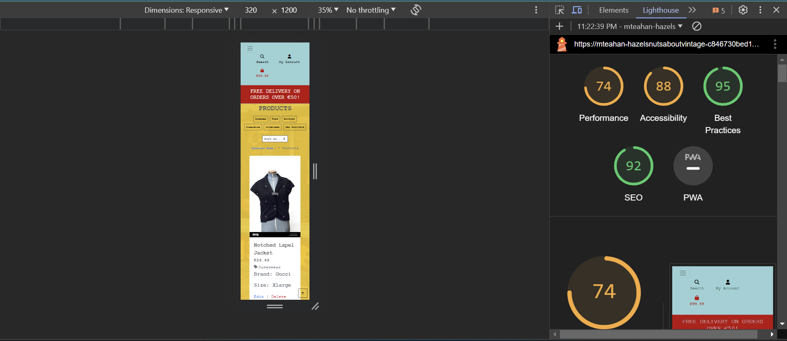
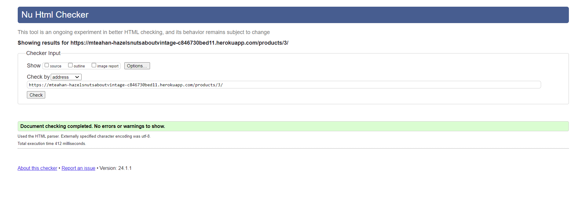
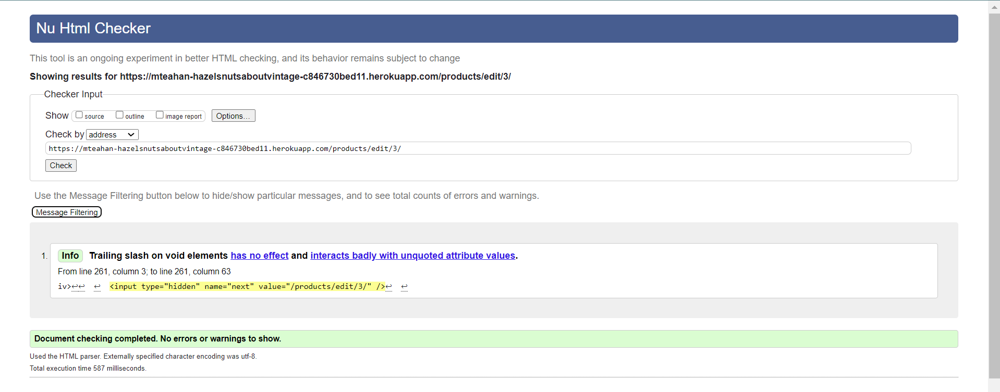
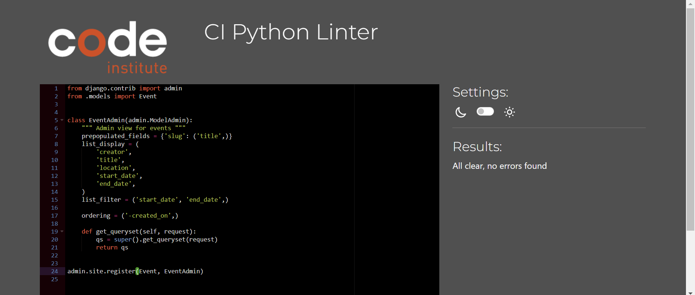
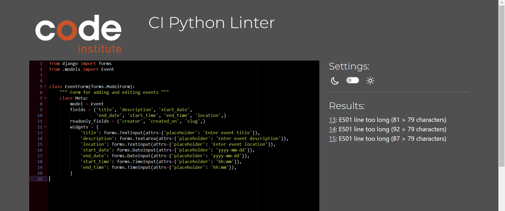

# TESTING

For a proper conclusion to this project several tests were performed.

## TABLE OF CONTENTS

* [RESPONSIVENESS TESTING](#responsiveness-testing)
* [BROWSER COMPABILITY TESTING](#browser-compability-testing)
* [BUGS RESOLVED AND UNRESOLVED](#bugs-resolved-and-unresolved)
* [LIGHTHOUSE TESTING OUTCOMES](#lighthouse-testing-outcomes)
* [CODE VALIDATION](#code-validation)
* [USER STORIES TESTING](#user-stories-testing)
* [FEATURES TESTING](#features-testing)
* [AUTOMATED TESTING](#automated-testing)
* [TEST CASE](#test-case)

Return back to the [README.md](README.md) file.

- - -

## RESPONSIVENESS TESTING

The deployed application was tested on multiple devices to check for responsiveness issues. 

It works as expected according to the wireframes and no issue was found.

|Device| Screenshot | 
|:---|:---: |
| 1200px |    |
| 992px  |    |
| 768px  |    |
| 576px  |   |
| 320px  |   |

- - -

## BROWSER COMPABILITY TESTING

The deployed project was tested on multiple browsers to check for compatibility issues and works as expected.

|Browser | Screenshot | 
|:---:|:---: |
| Chrome |  |
| Edge  |  |
| Firefox |   |

- - -

## BUGS RESOLVED AND UNRESOLVED 

The issues listed in the table below were indentified during the development of the project.

### Resolved bugs and issues

|N.| Issue |  Action | Status | 
|:---|:--- |:--- |:--- |
|01| Instructions, Ingredients and Category fields weren't required to submit a new recipe | Remove null and blank = True and set a default | Closed | 
|02| edit/delete recipe available to all users | Add condition for user to authenticated and a super user to have edit/delete option render | Closed | 
|03| Brute forcing the URL to edit/delete recipe allowed non superuser to edit/delete recipes | Update views to have non-superusers redirected to 404 error page | Closed | 
|04| Brute forcing the URL to edit/delete comments allowed any user to edit/delete any other users' comments | Update views to have user's who isn't the comment owner redirected to 404 error page | Closed | 
|05| Alert messages wouldn't close when clicking the X | Add javascript to remove the element when the X is clicked | Closed | 
|06| edit/delete recipe available to all users | Add condition for user to authenticated and a super user to have edit/delete option render | Closed |
|09| Inpunt forms don't prepoulate fields with original comment or recipe values when editing | passed the recipe instance as an argument to the form constructor | Closed |
|10| Heroku deployment failing | Removed unused CAB import from msilib | Closed |
|11| Categories weren't rendering | In models.py relevant functions were moved inside catergories class as they were mistakenly sitting outside it | Closed | 
|12| 404 error page wasn't loading | Input handlere404 function to letseat views.py and at the end of relevant conditions in blog views.py   | Closed |
|13| Styles not rendering in live preview | Switch debug to true   | Closed |
|14| Console Error that messageRow is not a valid DOM element however it disappears when the alert message for logging in and out appears. | Delete relevant console.log from script.js | Closed |

### Unresolved bugs and issues

|N.| Issue |  Action | Status | 
|:---|:--- |:--- |:--- |
|| N/A | |  |

- - -

## LIGHTHOUSE TESTING OUTCOMES

The deployed project was tested using the Lighthouse Audit tool to check for any major issues. The results for each page are listed below.

|Page | Screenshot | Notes |
|:---:|:---: |:---: |
|Index Desktop |||
|Index Mobile || Height and width for images stated as reason for lower score. I tried changin them but it made no difference. |
|Products Desktop |||
|Products Mobile |||
|Product Detail Desktop |||
|Product Detail Mobile |||
|Add Products Desktop |||
|Add Products Mobile |||
|Edit Products Desktop |||
|Edit Products Mobile |||
|Events Desktop |||
|Events Mobile |||
|Event Detail Desktop |||
|Event Detail Mobile |||
|Add Events Desktop |||
|Add Events Mobile |||
|Edit Events Desktop |||
|Edit Events Mobile |||
|Delete Events Desktop |||
|Delete Events Mobile |||
|Bag Desktop |||
|Bag Mobile |||
|Checkout Desktop |||
|Checkout Mobile |||
|Checkout Success Desktop |||
|Checkout Success Mobile |||
|Coupon Desktop |||
|Coupon Mobile |||
|Feedback Desktop |||
|Feedback Mobile |||
|Feedback Detail Desktop |||
|Feedback Detail Mobile |||
|Signup Desktop |||
|Signup Mobile |||
|Login Desktop |||
|Login Mobile |||
|Logout Desktop |||
|Logout Mobile |||

- - -

## CODE VALIDATION

### HTML

The [HTML W3C Validator](https://validator.w3.org/) to validate all HTML files.
In order to properly validate the HTML pages with Jinja syntax, the steps are followed for each file:

- Navigate to the deployed application using Google Chrome,
- Right-click anywhere on the page, and select View Page Source.
- Copy the entire "compiled" code, without any Jinja syntax., and use the validate by input method.

The result for each page are listed bellow:

|Page |Screenshot | Notes  | 
|:---:|:----------------------:|---|
| Index |  | No Errors |
| Products |  | No Errors |
| Single Product |  | No Errors |
| Events |  | No Errors |
| Single Event |  | No Errors |
| Add Product |  | No Errors |
| Edit Product |  | No Errors |
| Add Event |  | No Errors |
| Edit Event |  | No Errors |
| Bag |  | No Errors |
| Checkout |  | No Errors |
| Checkout Success |  | No Errors |
| Coupon |  | No Errors |
| Feedback |  | No Errors |
| Single Feedback |  | No Errors |
| Signup |  | Error with signup form not accessible |
| Login |  | No Errors |
| Logout |  | No Errors |
| 404 |  | No Errors |

- - - 

### CSS

The [CSS Jigsaw Validator](https://jigsaw.w3.org/css-validator/) was used to validate the CSS file.

| File | Screenshot | Notes |
| --- | --- | --- |
| base.css | | No Errors |

- - - 

### JAVASCRIPT

The [JShint Validator](https://jshint.com/) was used to validate the JavaScript file.

| File | Screenshot | Notes |
| --- | --- | --- |
| checkout_stripe_element.js |  | No Errors |
| profiles_countryfield.js |  | No Errors |

- - - 

### PYTHON

The [Code Institute Python Linter](https://pep8ci.herokuapp.com)was used to validate all Python files.

#### Network project

| File | Screenshot  | Notes|
| --- | ------ |:---:|
| settings.py |    | Pass |
| urls.py (main) |    | Pass |
| views.py |   | Pass |

#### Bag app

| File | Screenshot  | Notes|
| --- | --- | --- |
| bag_tools.py |    | Pass |
| contexts.py |    | Pass |
| urls.py |    | Pass |
| views.py |    | Pass |

#### Checkout app

| File | Screenshot  | Notes|
| --- | --- | --- |
| admin.py |    | Pass |
| forms.py |    | Pass |
| models.py |    | Pass |
| urls.py |    | Pass |
| views.py |    | Pass |
| signals.py |    | Pass |
| webhook_handlers.py |    | Pass |
| webhooks.py |    | Pass |

#### Coupon app

| File | Screenshot  | Notes|
| --- | --- | --- |
| admin.py |    | Pass |
| models.py |    | Pass |
| urls.py |    | Pass |
| views.py |    | Pass |

#### Events app

| File | Screenshot  | Notes|
| --- | --- | --- |
| admin.py |    | Pass |
| forms.py |    | Pass |
| models.py |    | Pass |
| urls.py |    | Pass |
| views.py |    | Pass |

#### Feedback app

| File | Screenshot  | Notes|
| --- | --- | --- |
| admin.py |    | Pass |
| forms.py |    | Pass |
| models.py |    | Pass |
| urls.py |    | Pass |
| views.py |    | Pass |

#### Home app

| File | Screenshot  | Notes|
| --- | --- | --- |
| urls.py |    | Pass |
| views.py |    | Pass |

#### Products app

| File | Screenshot  | Notes|
| --- | --- | --- |
| admin.py |    | Pass |
| forms.py |    | Pass |
| models.py |    | Pass |
| urls.py |    | Pass |
| views.py |    | Pass |
| widgets.py |    | Pass |

#### Profiles app

| File | Screenshot  | Notes|
| --- | --- | --- |
| forms.py |    | Pass |
| models.py |    | Pass |
| urls.py |    | Pass |
| views.py |    | Pass |

- - -

## USER STORIES TESTING

The implemented User Stories were tested during the development of this project and also after it was finished.

### Site User

- - -

As a Site User, I want to be able to:

*Must Have*

| User Stories |  Notes|
| --- | --- | 
| I can click an Add to Bag button so that I can ladd the product to my bag to purchase. | Pass |
| I can enter my details so that I can pay for the product and have it delivered to the correct address. |  Pass |
| I can view a list of products so that I can choose one to buy. | Pass |
| I can view a product so that I can inspect the product in more detail and add it to my bag. | Pass |

*Should Have*

| User Stories |  Notes|
| --- | --- | 
| I can give feedback so that I can let the store owner know about my experience with the online store. |  Pass |
| I can sign up to be a member/ login as an existing member so that I can be a part of the site's community and receive updates. |  Pass |
| I can view my profile so that I can review my personal info and previous order history. |  Pass |

*Could Have*

| User Stories |  Notes|
| --- | --- | 
| I can get a coupon for a discount so that I can use it in-store. | Pass |
| edit or delete my comment so that if I made a spelling error or changed my mind about what I said I can edit or delete it. | Pass |
| I can view a list of events so that I can see if the store is running any events I would be interested in. | Pass |
| I can view an event so that I can inspect the event in more detail. | Pass |

### **Site Admin**

- - -

As Site Admin for the site I want to be able to:

*Must Have*

| User Stories |  Notes|
| --- | --- | 
| create, edit and delete products so that I can be in control of what products are shown to Site Users. | Pass |
| create, edit and delete events so that I can be in control of what events are shown to Site Users. | Pass |

*Should Have*

| User Stories |  Notes|
| --- | --- | 
| assign a category, size and brand to the products so that Site Users will be able to find products specific to what they need. | Pass |
| offer a coupon after a purchase so that I can draw Site Users users back to my store. | Pass |
|  view my customers feedback so that I can see the areas in which the business is lacking and improve. | Pass |

- - -

## FEATURES TESTING

| Page | User Action | Expected Result| Notes |
| --- | --- | --- | --- |
| **Index**   |  |  | |
| | Click on Logo | Redirection to Index page | Pass |
| | Click on Nav Toggle | Show Nav items - Home, Recipes, Signup, Login | Pass |
| | Click on Nav Toggle (while logged in) | Show Nav items - Home, Recipes, Logout | Pass |
| | Click on Nav Toggle (while admin logged in) | Show Nav items - Home, Recipes, Logout, Add Recipe | Pass |
| | Click on Home button | Redirection to Index page | Pass |
| | Click on Discover Recipes | Redirection to All Recipes page | Pass |
| | Click on Sign Up button  | Redirection to Sign Up page | Pass |
| | Click on Login button | Redirection to Login page | Pass |
| | Click on Discover Recipes button | Redirection to All Recipes page | Pass |
| **Sign Up** |  |  |  |
| | Click Sign Up button | Username required | Pass |
| | Click Sign Up button (username provided) | Password required | Pass |
| | Click Sign Up button (username and password provided) | Password (again) required | Pass |
| | Click Sign Up button with all valid information | Redirection to Index page and displays message | Pass |
| | Click Sign Up button (username, email (already in use), password, password (again) provided, passwords matching) | Field only accepts new email | Pass |
| | Click Sign Up button (username, password, password (again) provided, passwords matching, using invalid password format) | Field will only accept password format  | Pass |
| | Click Sign Up button (username, password, password (again) provided, passwords not matching) | Passwords required to match | Pass |
| | Click on Login link | Redirection to Login page | Pass |
| | Click Cancel button | Redirection to Index page | Pass |
| **Log In** |  |  |  |
| | Click Login button | Username required | Pass |
| | Click Login button (username provided) | Password required | Pass |
| | Click Login button (valid username and invalid password provided) | Username and/or password incorrect | Pass |
| | Click Login button (invalid username provided) | username and/or password incorrect  | Pass |
| | Enter user email address in username field | field will only accept valid username | Pass |
| | Enter valid password | Field will only accept password format | Pass |
| | Click Login button with all valid information | Redirection to Index page and displays message | Pass |
| | Click on Sign Up link | Redirection to Sign Up page | Pass |
| | Click Cancel button | Redirection to Index page | Pass |
| **Log Out** |  |  |  |
| | click on dropdown menu, then log out | Redirects to log out page | Pass |
| | Click to confirm to sign out  | Redirects to landing page and displays message with the sign out confirmation | Pass |
| | Click Cancel button | Redirection to Index page | Pass |
| **Products** |  |  |  |
| | Click image on a product | User will be redirected to the Product Detail page | Pass |
| | Click each option in sort by drop down | Products' order changes depending on what they're being sorted by | Pass |
| **Product Detail** |  |  |  |
| | Click the Add to Bag button | Success message to say item has been added to bag, bag icon show the value of the products in the bag | Pass |
| | Click delete on product (only visable to admin)  | Product will be permanently deleted and User will be redirected to the Product | Pass  |
| | Click edit on product (only visable to admin) | User is redirected to Edit Product page | Pass |
| | Brute forcing the URL to delete product if not logged in | Redirects user to login page | Pass | 
| | Brute forcing the URL to delete product while logged in (NOT admin) | Redirects user to products page with error message | Pass |
| | Brute forcing the URL to edit product if not logged in | Redirects user to login page | Pass | 
| | Brute forcing the URL to edit product while logged in not as (NOT admin) | Redirects user to products page with error message | Pass |
| **Events** |  |  |  |
| | Click button on a event | User will be redirected to the Event Detail page | Pass |
| **Event Detail** |  |  |  |
| | Click go back button  | User is redirected to Events page | Pass  |
| | Click delete on event (only visable to admin)  | User is redirected to Delete Event confirmation page | Pass  |
| | Click edit on event (only visable to admin) | User is redirected to Edit event page | Pass   |
| | Brute forcing the URL to delete event if not logged in | Redirects user to login page | Pass | 
| | Brute forcing the URL to delete event while logged in (NOT admin) | Redirects user to events page with error message | Pass |
| | Brute forcing the URL to edit event if not logged in | Redirects user to login page | Pass | 
| | Brute forcing the URL to edit event while logged in not as (NOT admin) | Redirects user to events page with error message | Pass |
| **Add Product** |  |  |  |
| | Click Submit on add product form without adding content | User is prompted to enter something into each field before submitting | Pass |
| | Click Cancel on add product form | User will be redirected to Products | Pass |
| **Edit Product** | | | | 
| | Fill in post form and click submit | Original product can be edited and User will be redirected to the Products | Pass | 
| | Click on the Cancel button | User will be redirected to the Products | Pass | 
| **Add Event** |  |  |  |
| | Click Submit on add event form without adding content | User is prompted to enter something into each field before submitting | Pass |
| | Click Cancel on add event form | User will be redirected to Events | Pass |
| **Edit Event** | | | | 
| | Fill in post form and click submit | Original event can be edited and User will be redirected to the Events | Pass | 
| | Click on the Cancel button | User will be redirected to the Events | Pass | 
| **Delete Event** | | | | 
| | Click on the Delete button | Event will be permanently deleted and User will be redirected to the Events | Pass | 
| | Click on the Cancel button | User will be redirected to the Events | Pass | 
| **Error Pages** | | | | 
| | Click on Home button | User will be redirected to Index page | Pass | 
| **Bag** |  |  |  |
| | Click the Secure Checkout button | Redirected to Checkout page | Pass |
| | Click the Keep Shopping button | Redirected to Products | Pass |
| | Click the Remove link | Item is removed from bag | Pass |
| **Checkout** |  |  |  |
| | Click the Complete Order without filling in required fields | Request denied until all required fields are entered | Pass |
| **Checkout Sucess** |  |  |  |
| | Click the Coupon button | Redirected to new tab with coupon | Pass |
| | Click the submit button for feedback | All fields must be filled out before submitting | Pass |
| **Feedback** |  |  |  |
| | Click button on a event | User will be redirected to the Event Detail page | Pass |
| | Brute forcing the URL to view the page if not logged in | Redirects user to login page | Pass | 
| | Brute forcing the URL to view the page while logged in (NOT admin) | Redirects user to home page with error message | Pass |
| **Feedback Detail** |  |  |  |
| | Click go back button  | User is redirected to Events page | Pass  |
| | Brute forcing the URL to view the page if not logged in | Redirects user to login page | Pass | 
| | Brute forcing the URL to view the page while logged in (NOT admin) | Redirects user to home page with error message | Pass |
| **Footer** | | | | 
| | Click on Facebook Icon | Opens new tab to Facebook | Pass |
| | Click on Instagram Icon | Opens new tab to Instagram | Pass |
| | Click on submit | Email address required | Pass |

- - -

Return back to the [README.md](README.md) file.